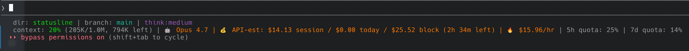

# <p align="center">
  
</p>

[](https://github.com/kinncj/statusline/actions/workflows/ci.yml)
[](LICENSE)
[](https://www.gnu.org/software/bash/)
[](CONTRIBUTING.md)
[](CODE_OF_CONDUCT.md)

A portable, two-line statusline for AI CLIs. Shows model, context usage with tokens remaining, API-estimated costs, and Claude.ai rate-limit quotas with reset times.

<p align="center">
  
</p>

Plain-text version of the same output (handy for copy/paste, terminal previews):

```
dir: statusline | branch: main | think:medium
context: 20% (205K/1.0M, 794K left) | 🤖 Opus 4.7 | 💰 API-est: $14.13 session / $0.00 today / $25.52 block (2h 34m left) | 🔥 $15.96/hr | 5h quota: 25% | 7d quota: 14%
```

## Install

### Quick — `curl | bash`

```bash
curl -fsSL https://raw.githubusercontent.com/kinncj/statusline/main/bootstrap.sh | bash
```

The bootstrap clones the repo into `~/.local/share/kinncj-statusline` and runs the installer for every supported CLI it finds on `$PATH`. To pass flags through to the installer:

```bash
curl -fsSL https://raw.githubusercontent.com/kinncj/statusline/main/bootstrap.sh | bash -s -- --dry-run
curl -fsSL https://raw.githubusercontent.com/kinncj/statusline/main/bootstrap.sh | bash -s -- --target claude-code
curl -fsSL https://raw.githubusercontent.com/kinncj/statusline/main/bootstrap.sh | bash -s -- --uninstall
```

Override defaults via env: `STATUSLINE_REPO=owner/fork STATUSLINE_REF=v1.2.3 STATUSLINE_DIR=~/elsewhere curl … | bash`.

### Manual — clone + run

```bash
git clone https://github.com/kinncj/statusline ~/Development/kinncj/statusline
cd ~/Development/kinncj/statusline
./install.sh                     # auto-detect all supported CLIs on $PATH
./install.sh --target opencode   # one specific tool, repeatable
./install.sh --dry-run           # preview without changing anything
./install.sh --uninstall         # remove statusline wiring
./install.sh --no-animation      # skip the animated intro (also: NO_COLOR=1, TUI_NO_ANIM=1)
./install.sh --quiet             # suppress the logo entirely
```

The installer renders a boxed, animated TUI by default. Animations auto-disable when stdout isn't a TTY (CI, pipes), and color follows `NO_COLOR`.

## Supported targets

| Tool                       | Statusline | AGENTS.md | Config path                              |
|----------------------------|:----------:|:---------:|------------------------------------------|
| **Claude Code**            | ✓          | ✓         | `~/.claude/settings.json`                |
| **GitHub Copilot CLI**     | ✓          | ✓         | `~/.copilot/settings.json`               |
| **OpenCode**               | ⚠ pending  | ✓         | `~/.config/opencode/opencode.json` (FR: anomalyco/opencode#8619) |
| **Pi (pi.dev)**            | —          | ✓         | `~/.pi/agent/` — Pi uses npm extensions, not a script hook |
| **Hermes (nousresearch)**  | —          | ✓ + skill | `~/.hermes/` (full TUI, no script hook)  |

Pi and Hermes don't expose a script-driven statusline:
- **Pi** customizes its footer through npm extensions (`pi install npm:pi-powerline-footer`, `pi-bar`, `pi-side-agents`). Our installer drops AGENTS.md and points you at those.
- **Hermes** ships a fixed built-in TUI with skin-level theming only. We install AGENTS.md + the `statusline-edit` skill so the repo's instructions travel with you.

**OpenCode** doesn't ship the hook yet — the installer writes the two proposed key shapes speculatively so it'll work as soon as anomalyco/opencode#8619 ships.

## What's in line 2

- `context: N%` of the context window, with `(used/total, remaining)` in human units
- `🤖` model name (from ccusage)
- `💰 API-est:` session / today / billing-block costs — **API list-price estimates**, not what Claude.ai Pro/Max subscribers actually pay
- `🔥 $X/hr` burn rate
- `5h quota` / `7d quota` percentage and reset countdown (Claude.ai subscriber data, when the host provides it)

## Dependencies

- `bash`, `jq`, `awk`, `sed`, `date`, `stat`, `git`
- `npx` (for ccusage — optional; the cost block is skipped if unavailable)

## Hacking on it

Read `AGENTS.md` — it has the conventions, the bash gotchas, the host JSON schemas, and the test recipe. Mock fixtures live in `tests/`.

If you're an AI agent working in this repo (Claude Code, OpenCode, etc.), `AGENTS.md` is loaded automatically. The `.claude/` and `.opencode/` directories also contain in-repo agent definitions for testing and safe-edit workflows.

## Tests

```bash
tests/run.sh                  # full bats suite (install bats first)
tests/run.sh claude-code      # filter by name
```

See [`AGENTS.md`](AGENTS.md#testing-changes) for the full recipe (mock fixtures, ccusage stub, etc.).

## Project docs

- [Changelog](CHANGELOG.md) — release notes per version.
- [Contributing](CONTRIBUTING.md) — how to send a patch and the bar it has to clear.
- [Code of Conduct](CODE_OF_CONDUCT.md) — Contributor Covenant 2.1.
- [Security](SECURITY.md) — how to report a vulnerability (don't open a public issue).
- [Authors](AUTHORS.md) — maintainer + contributor credits.

## License

Copyright © 2026 **Kinn Coelho Juliao** &lt;kinncj@protonmail.com&gt;

Released under the [**GNU General Public License v3.0 or later**](LICENSE) (`SPDX-License-Identifier: GPL-3.0-or-later`). You may use, modify, and redistribute this code — provided any derivative works stay under a GPL-compatible license. The full license text lives in [`LICENSE`](LICENSE); each source file carries an SPDX header for unambiguous attribution.
